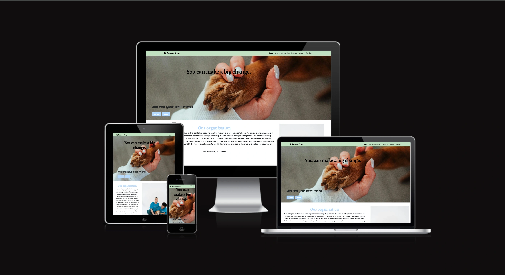
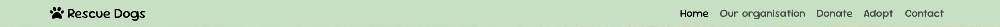
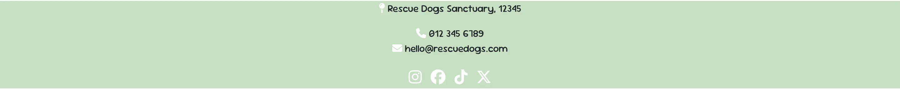
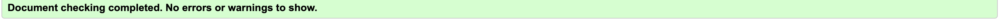
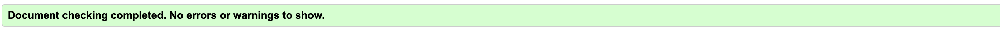
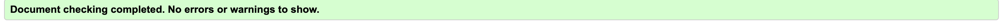
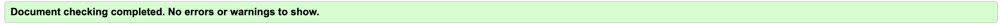
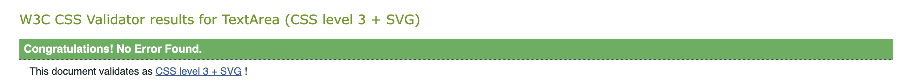
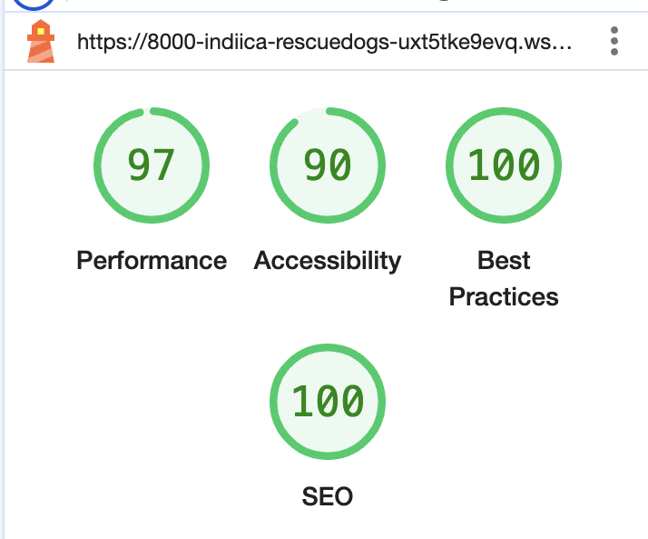

# Rescue Dogs
Rescue Dogs is a site for Organisation "Rescue Dogs". This platform serves as a bridge between rescue dogs and their forever families. We focus on:

+ Dog Adoption: Connecting adoptive families with rescue dogs in need of a home.

+ Donations: Encouraging individuals to contribute to the care, medical treatment, and feeding of rescue dogs.
By adopting, donating, or even sharing our cause, you are helping to provide better futures for dogs and families alike.

### **User story**
**Overview**

As a potential dog adopter or donor, I want to be able to:
1. Easily view profiles of dogs available for adoption
2. Donate to the rescue organization in a simple and secure way, knowing that my contributions will go toward the care, medical treatment, and shelter of the dogs in need.
3.  Access information about the organization's goals and impact, so I can feel confident in my support for their work.

# Features

 ## Existing Features

+ **Navigation Bar**

The full responsive navigation bar includes links to the Logo, Home page, Our organisation section, Donate page and  Adopt page.

This section is helping out users to easily check the whole site and everything they are interested about related to the organisation.

+ **Hero image and Buttons**

The hero image with the text has a goal to show how passionate but yet serious is this organisation for dogs that need help. 

Buttons "Donate" and "Adopt" are easily leading to the Donate page or Adopt page, which helps user to reach their goal fast.

+ **Our organisation section**

This section is sharing about the organisation and their goals. For users to get to know them better and have better perception.

+ **The footer**

The footer section includes address, a phone number, an email and links to the relevant social media sites for Rescue Dogs. The links will open to a new tab to allow easy navigation for the user.

+ **The Adopt Page**

The Adopt page includes photos of the available dogs for adopting with their Names and Year of rescuing.There is also a button *"Contact us for more informations!"* that is leading users to the Contact section.

+ **The Donate Page**

The Donate page includes Heading with a briefly description for what donation would be used for. 
The user will be asked to submit their Name, Email address and the certain amount of money for donation.

+ **The Thank you Page**

This page is made for users as a confirmation of their  donation.

# Testing

## Validation

### **HTML**

No errors were returned when passing through the official [W3C validator](https://validator.w3.org/)

### **CSS**

No errors were found when passing through the official [Jigsaw validator](https://jigsaw.w3.org/css-validator/)

## Lighthouse

## Functional Testing

| Action      | Expected behaviour       | Pass/Fail       |
|----------------|----------------|----------------|
|Click on link to website  | Open Home page  | Pass  |
| Click on the Logo  | Refresh Home page  |Pass   |
| Click on Home   | Refresh Home Page   | Pass   |
| Click on Our organisation  | Show Our organisation section  | Pass  |
| Click on Donate  | Open Donate page   | Pass   |
| Click on Adopt  | Open Adopt page   | Pass  |
| Click on Contact  | Show Contact setion  | Pass   |
| Click on Donate button   | Open Donate page   | Pass  |
| Click on Adopt button   | Open Adopt page   | Pass   |
| Click on Donate button in Donate page   | Show to fill up with Name, Email and certain amount of money for donation | Pass   |
| Click on Donate button in Donate page with required informations about yourself| Show Thank you page  | Pass   |
| Click on Return to Home page   | Open Home page   | Pass  |
| Click on Contact us for more infromations  | Show Contact setion   | Pass |
| Click on Instagram icon   |Open in new tab Instagram site   | Pass  |
| Click on Facebook icon   | Open in new tab Facebook site   | Pass  |
| Click on Tiktok icon    | Open in new tab Tiktok site  | Pass  |
| Click on Twitter icon   | Open in new tab Twitter site  | Pass   |

# Deployment

 The live link can be found here - [Rescue Dogs](https://indiica.github.io/rescue-dogs/)

### Publishing
1. Click on Settings button in Github Repo
2. In section "Code and automation" click on "Pages" button
3. Select "main" in the branch
4. Save the changes

### Cloning
1. Click on Code button in Github Repo
2. Click Copy button to copy url to clipboard
3. Open terminal (Mac) or Command Prompt (Windows)
4. Enter: git clone -Paste-

# Credits

### **Content**

Inspired by Instagram posts of Rescue organisation in Serbia. [Udomi i spasi](https://www.instagram.com/udomi_i_spasi/)

 ### **Media**
All photos are taken from [Pexels.com](https://www.pexels.com/)

All icons were used from[Font Awesome](https://fontawesome.com)

The Fonts "Sour Gummy" and "Alegreya" were taken from [Google fonts](https://fonts.google.com/)